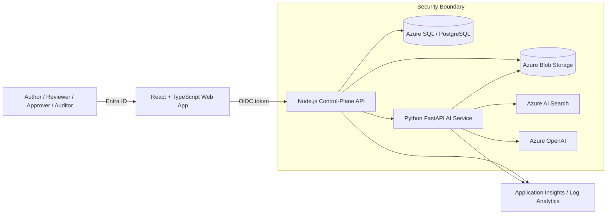
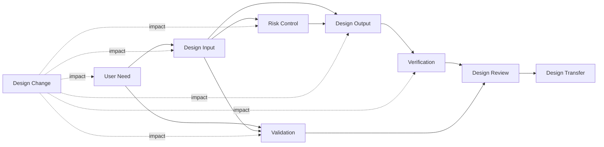

# IVD AI Design Control Assistant — Solution Architecture

## 1. Purpose

The platform supports controlled authoring, review, traceability, and phase-gate readiness for IVD design and development records. It assists qualified personnel but does not autonomously approve requirements, close risks, accept verification or validation results, or release a design.

## 2. Business outcomes

| Outcome metric | Definition | Target after stabilization |
|---|---|---:|
| Requirements authoring effort | Hours from source review to review-ready design inputs | 30–50% reduction |
| First-pass acceptance | Requirements accepted without substantive rework | ≥70% |
| Traceability completeness | Approved records with required upstream and downstream links | ≥95% |
| Orphaned record rate | Records missing required trace links | <2% |
| Phase-gate preparation time | Effort to prepare gate evidence and review packs | 30–40% reduction |
| Change-impact cycle time | Time to identify affected records and tests | 25–40% reduction |

## 3. Functional scope

- Design and development planning
- User needs and intended-use records
- Design inputs and design outputs
- Risk controls and ISO 14971 traceability
- Verification and validation planning and evidence
- Design reviews and phase-gate readiness
- Design transfer records
- Design changes and impact assessment
- End-to-end traceability matrix
- Controlled audit trail and human approvals

## 4. Logical architecture

## 5. Component responsibilities

### React web application

- Design-control workspace
- Requirements editor and critique panel
- Traceability graph and gap dashboard
- Phase-gate checklist
- Review and approval workflow
- Audit-history viewer

The browser never calls Azure OpenAI or Azure AI Search directly.

### Node.js control-plane API

- Entra token validation
- Project membership and role enforcement
- Workflow-state validation
- Design-record CRUD operations
- Trace-link integrity checks
- Review and approval routing
- Signed audit-event creation
- AI-service request orchestration

### Python AI service

- Evidence retrieval and prompt assembly
- Atomic requirement generation
- Requirement ambiguity and testability critique
- Trace-link recommendations
- Duplicate and conflict detection
- Change-impact candidate generation
- Phase-gate readiness summaries
- Structured output and citation validation

### Azure AI Search

- Hybrid keyword and vector retrieval
- Semantic reranking
- Project, document-status, version, and ACL filters
- Evidence-location metadata for citations

### Azure Blob Storage

- Controlled source documents
- Immutable document versions
- Verification and validation evidence
- Controlled exports

### Relational database

- Projects and members
- Design records and versions
- Trace links
- Reviews and approvals
- Phase gates
- Change requests
- Audit-event metadata

## 6. Core traceability model

Required links are configurable by record type and lifecycle phase. A record cannot move to an approved state when mandatory links or required evidence are missing unless an authorized exception with rationale is recorded.

## 7. Generation sequence

1. User selects a project, lifecycle phase, record type, and approved evidence set.
2. API validates identity, role, project membership, and workflow state.
3. AI service forms a bounded retrieval query.
4. Search returns only authorized, approved, effective evidence.
5. AI service constructs an evidence-only prompt.
6. Azure OpenAI returns structured JSON.
7. AI service validates schema, citations, and allowed record types.
8. API stores a new immutable record version and signed audit event.
9. UI displays generated content, evidence links, confidence, and gaps.
10. Independent reviewers and approvers complete controlled decisions.

## 8. AI guardrails

- Evidence allowlist and project-level security filtering
- Prompt-injection isolation from source documents
- Structured JSON output contracts
- Citation validation against retrieved evidence
- Requirement atomicity and testability checks
- No autonomous approval or release action
- Human review required before status transitions
- Model and prompt versions captured with every generated record
- Golden-dataset regression testing before deployment

## 9. Deployment topology

Production uses separate development, validation, and production environments. Each environment should include:

- Azure App Service or Azure Container Apps for frontend, API, and AI service
- Azure OpenAI
- Azure AI Search
- Azure Storage
- Azure SQL Database or PostgreSQL
- Azure Key Vault
- Azure Container Registry
- Application Insights and Log Analytics
- Virtual network integration, private endpoints, and private DNS
- Managed identities for service-to-service access

## 10. Availability and recovery

- Zone-redundant services where supported
- Database point-in-time restore
- Blob soft delete, versioning, and immutable retention where required
- Search-index rebuild procedure from controlled source records
- Defined RPO/RTO by environment
- Tested backup, restore, and disaster-recovery procedures
